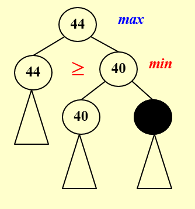
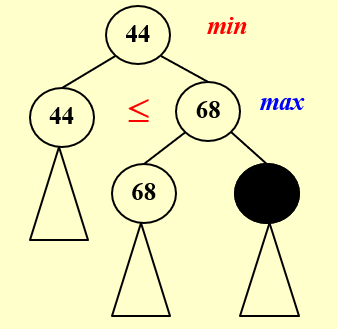
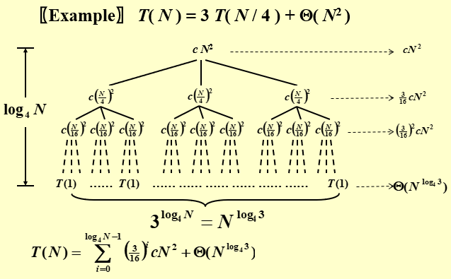

### Backtracking

* Eight Queens
  * Construct a game tree
  * Perform a depth-first search ( post-order traversal ) to examine the paths
  * Note: No tree is actually constructed. The game tree is just an abstract concept.
* The Turnpike Reconstruction Problem
* When different Si’s have different sizes
  * Smaller first
* Tic-tac-toe:  Minimax Strategy
  * $\alpha$ pruning
    
  * $\beta$ pruning
    

### Divide and Conquer

* Recursively
  * Divide
  * Conquer
  * Combine
  * $T(N) = aT(N/b) + f(N)$
* Example: Closest Points Problem
  * Use a strip
  * Furthermore, sort by y coordinate

### Three methods for solving recurrences $T(N) = aT(N/b) + f(N)$

* Substitution method: guess, then prove by induction

* Recursion-tree method
  

* Master Theorem: $T(N) = aT(N/b) + f(N)$

  * If $f(N) = O(N^{\log_b{a} - \epsilon})$ for some constant $\epsilon>0$, then $T(N) = \Theta(N^{\log_b{a}})$
  * If $f(N) = \Theta(N^{\log_b{a}})$ for some constant $\epsilon>0$, then $T(N) = \Theta(N^{\log_b{a}})\log N$
  * If $f(N) = \Omega(N^{\log_b{a} + \epsilon})$ for some constant $\epsilon>0$ and *regularity condition* 
    ($af(N/b) < cf(N)$ for some constant $c < 1$ and sufficiently large $N$), then $T(N) = \Theta(f(N))$

* Master Theorem (another form)

  * If $af(N/b) = \kappa f(N)$ for some constant $\kappa < 1$, then $T(N) = \Theta(f(N))$
  * If $af(N/b) = \Kappa f(N)$ for some constant $\Kappa > 1$, then $T(N) = \Theta(N^{\log_b{a}})$
  * If $af(N/b) = f(N)$, then $T(N) = \Theta(f(N))\log_bN$

* Theorem: for $T(N) = aT(N/b) + \Theta(N^k\log^pN)$

  * $$
    T(N) = \left\{
    	\begin{aligned}
    		&O(N^{\log_b{a}}),\ a>b^k\\
    		&O(N^k\log^{p+1}N),\ a=b^k\\
    		&O(N^k\log^pN),\ a<b^k
    	\end{aligned}
    \right.
    $$

### Dynamic Programming

* Solve sub-problems just once and save answers in a table (instead of recursion)

* Ordering Matrix Multiplications

  * $$
    m_{ij} = \left\{
    	\begin{aligned}
    		&0,\ i=j\\
    		&\min _{i \leq l <j}\left\{m_{i l}+m_{l+1 j}+r_{i-1} r_{l} r_{j}\right\},\ j>i
    	\end{aligned}
    \right.
    $$

  * $T(N) = O(N^3)$

* Optimal Binary Search Tree

  * $c_{i j}=\min _{i<l \leq j}\left\{w_{i j}+c_{i, l-1}+c_{l+1, j}\right\}$
  * $T(N) = O(N^3)$

* All-Pairs Shortest Path

  * $\boldsymbol{D}^{k}[i][j]=\min \left\{\boldsymbol{D}^{k-1}[i][j], \boldsymbol{D}^{k-1}[i][k]+\boldsymbol{D}^{k-1}[k][j]\right\},\ \boldsymbol{k} \geq \mathbf{0}$
  * $T(N) = O(N^3)$, faster in dense graph

### Greedy Algorithms

* Activity Selection Problem 
  * Greedy Rule: Select the interval which ***ends first***
* Huffman Codes

