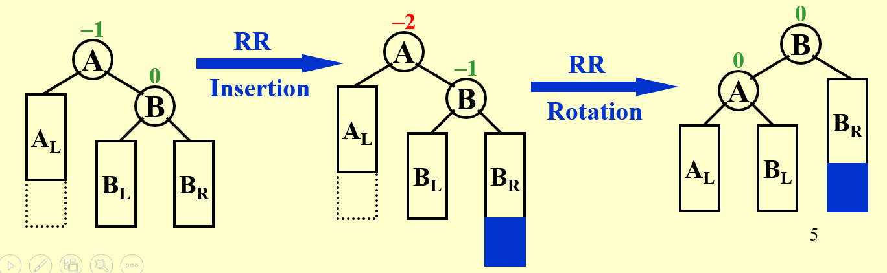
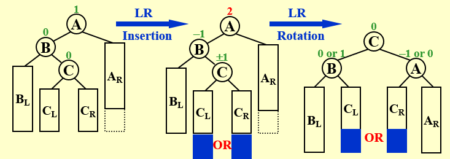
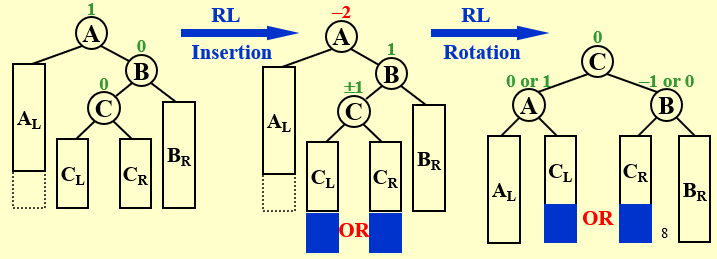
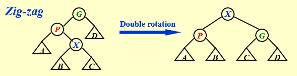
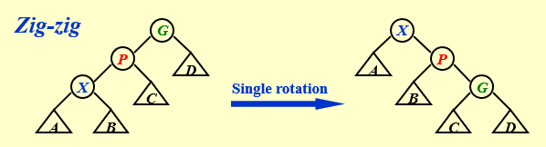
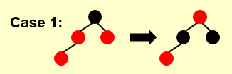
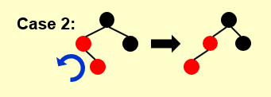
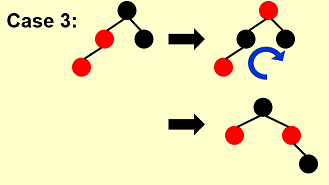

### AVL, Splay, Amortized

#### AVL

* Definition (height balanced)
  * $T_L$ and $T_R$ are height balanced
  * $|h_L-h_R|\leq 1$ (height of NULL is -1)
* balance factor $BF(\text{node})=h_L-h_R$
  * For AVL, should be -1, 0 or 1
* RR rotation
  
* LR rotation
  
* RL rotation
  
* $n_h$: The minimum number of nodes in an AVL tree of height $h$, then
  * $n_h=n_{h-1}+n_{h-2}+1$
  * $n_h=F_{h+2}-1$, where $F_0=0,F_1=1$, $F_i$ Fibonacci numbers

#### Splay Tree

* For non-root node $X$, whose parent $P$ , grandparent $G$
  * $P$ root: single rotation
  * $P$ non-root
    * Zig-zag
      * Double Rotation (like AVL)
        
    * Zig-zig
      * Single Rotation (rotate $G,P$ first, then $P,X$)
        

#### Amortized Analysis

* worst-case > amortized > average-case
* Potential method
  * $c_i$: the real cost of $i$, $\hat{c}_i = c_i + \text{Credit}_i$: amortized cost
  * Credit = $\Phi(D_i)-\Phi(D_{i-1})$
  * Total amortized cost = $\sum_{i=1}^n \hat{c}_i = \sum_{i=1}^n c_i + \Phi(D_n) - \Phi(D_0)$
  * $\Phi(D_0)$ is the minimal of $\Phi(D_n)$ such that $\hat{c}_i \geq c_i$

### R-B Tree and B+ Tree

#### Red-Black Tree

* Definition
  * Each node red or black
  * root black
  * NIL black
  * children of red are black
  * For each node, all simple paths from the node to descendant leaves contain the same number of black nodes.
* Black-height of node x bh(x) : number of black nodes from x (x not included) to leaf
* A red-black tree with N internal nodes has height at most 2ln(N +1).
  * $\text{bh}(Tree) \geq \text{h}(Tree) / 2$
  * the path from the root to the farthest leaf is no more than twice as long as the path from the root to the nearest leaf
* Insert
  * 
  * 
  * 
* Delete

#### B+ Trees

* Definition (B+ Tree with order M)
  * The root is either a leaf or has between 2 and M children
  * All non-leaf nodes (except the root) have between $\lceil$M/2$\rceil$ and M children
  * All leaves are at the same depth
  * Leaf nodes can have at most M elements (**different from DB!**)

### Inverted File Index

* Word Stemming : Process a word so that only its stem or root form is left. 

* Stop Words : too common to index, e.g. "a", "the"

* Distributed indexing

  * Term-partitioned index
    A-C D-F ... X-Z
  * Document-partitioned index
    1-10000 10001-2000 ... 90001-100000

* Compression

  * Posting List

* Measures for search engine

  * How fast does it index
  * How fast does it search
  * Expressiveness of query language

* Data Retrieval Performance Evaluation 

  * Response time
  * Index space

* Information Retrieval Performance Evaluation

  * How relevant

* Relevance Measurement

  * |                   | Relevant | Irrelevant |
    | :---------------: | :------: | :--------: |
    |   **Retrieved**   |  $R_R$   |   $I_R$    |
    | **Not Retrieved** |  $R_N$   |   $I_N$    |

  * Precision $P=\frac{R_R}{R_R+I_R}$

  * Recall $R=\frac{R_R}{R_R+R_N}$

