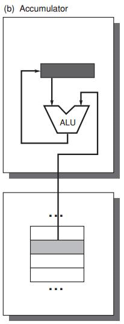
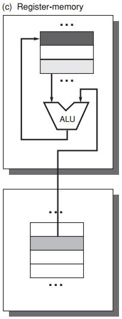
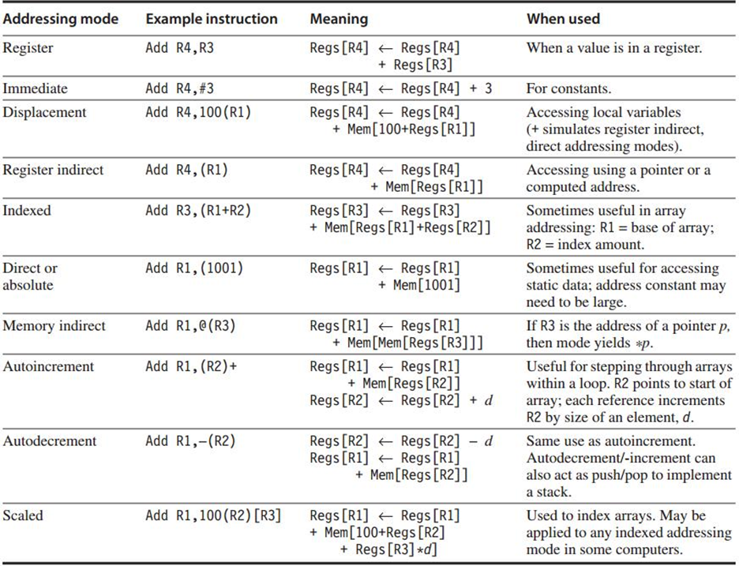

### Instruction Set Architecture

#### ISA Classification Basis

* Stack Architecture

  * implicit operands on the Top Of the Stack (TOS)

  * C = A + B 
    ```
    Push A
    Push B
    Add 
    Pop C
    ```
    
    
  
* Accumulator Architecture

  * one implicit operand: the accumulator

  * one explicit operand: mem location

  * C = A + B

    ```
    Load A
    Add B
    Store C
    ```

    

* General-Purpose Register Arch

  * register-memory architecture: any instruction can access memory

    * C = A + B

      ```
      Load R1, A
      Add R3, R1, B
      Store R3, C
      ```

      

  * load-store architecture: only load and store instructions can access memory

    * C = A + B

      ```
      Load R1, A
      Load R2, B
      Add R3, R1, R2
      Store R3, C	
      ```

#### Operands

* Byte addressing

* Byte ordering in memory: 0x12345678

  * Little Endian: 78 | 56 | 34 | 12
  * Big Endian: 12 | 34 | 56 | 78

* Address alignment

* Addressing Modes

  * Types: constant (*immediate*), register, memory location (*effective address*)
  * 

* Operations

#### Control Flow Instructions

* Four types of control flow change
  * Conditional branches – *most frequent*
  * Jumps
  * Procedure calls
  * Procedure returns
* Addressing
  * Explicitly specified destination address
  * PC-relative: PC + displacement
  * Dynamic address (e.g. register)
* Save Registers
  * Caller Saving: the calling procedure saves the registers
  * Callee Saving: the called procedure saves the registers

#### ISA Encoding

* Opcode for specifying operations
* Address Specifier for specifying the addressing mode to access operands
* Fixed length VS variable length

#### Compiler

#### MIPS


