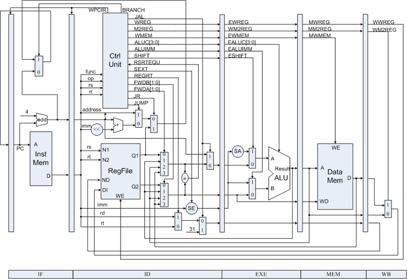
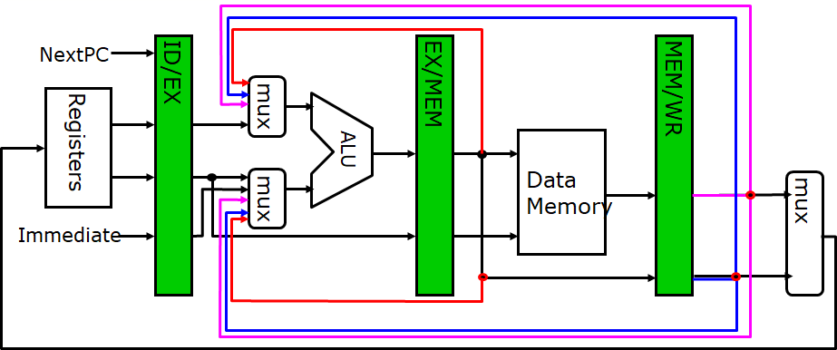
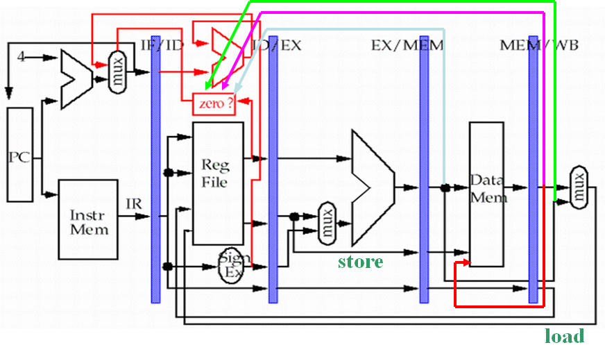

### Pipelining: Implementation

#### Datapath

* IF
  * IR **←** Mem[PC]; (IR: instruction register)
  * NPC **←** PC + 4; (NPC: next sequential PC)
* ID
  * A **←** Regs[rs];
  * B **←** Regs[rt];
  * Imm **←** sign-extended (IR[15:0])
* EX
  * Memory reference: ALUOutput **←** A + Imm;
  * Register-register: ALUOutput **←** A **func** B;
  * Register-Immediate: ALUOutput **←** A **op** Imm;
  * Branch: ALUOutput **←** NPC + (Imm<<2); Cond **←** (A == 0);
* MEM
  * Load: LMD **←** Mem[ALUOutput]; (LMD: Load memory data register)
  * Store: Mem[ALUOutput] **←** B; 
  * Branch: if (cond) PC **←** ALUOutput;
* WB
  * Register-register ALU instruction: Regs[rd] **←** ALUOutput;
  * Register-immediate ALU instruction: Regs[rt] **←** ALUOutput;
  * Load instruction: Regs[rt] **←** LMD;
* Data Hazard
* Stall
* Forwarding
  
* Branch
  

#### Exceptions

* Sync vs Async
  * Synchronous: event occurs at the same place every time the program is executed with the same data and memory allocation
  * Asynchronous: caused by devices external to the CPU and memory
* User requested vs Coerced
  * User requested
  * Coerced: caused by some hardware event that is not under the control of the user program
* User non/maskable: an event can / cannot be be masked or disabled by a user task
* Within vs Between instructions
* Resume vs Terminate
  * Resume: the program’s execution continues after the interrupt
  * Terminate: the program’s execution always stops after the interrupt
* If the pipeline can be stopped so that the instructions just before the faulting instruction are completed and those after it can be restarted from scratch, the pipeline is said to have precise exceptions.
* Instruction Set Complications

