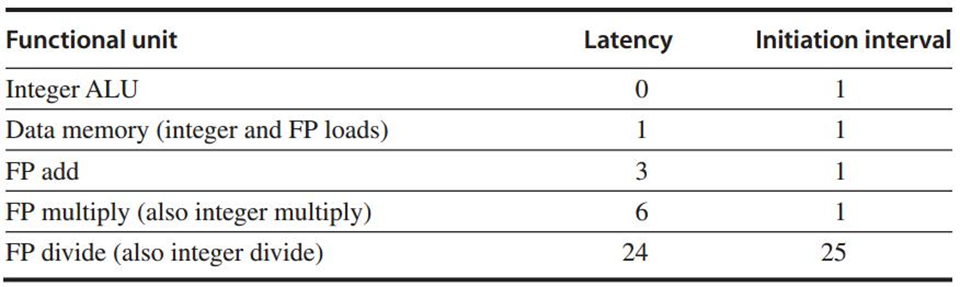
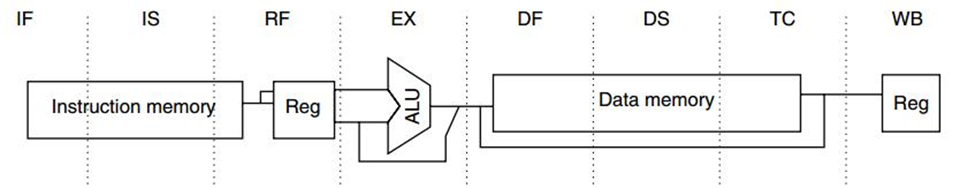

### Pipelining Multicycle, MIPS R4000, and More

#### Multicycle Floating-point (FP) operations 

* FP pipeline
  * allow for *a longer latency* for op (>1 cc for EXE)
  * 2 changes over integer pipeline
    * repeat EX
    * use multiple FP functional units
* Latency & Ini/Repeat Interval
  * Latency: the number of intervening cycles between an instruction that produces a result and an instruction that uses the result
  * Initiation/Repeat Interval: the number of cycles that must elapse between issuing two operations of a given type
  * 
* Structural Hazard
  * Divider is not fully pipelined
* WAW Hazard
  * Instructions no longer reach WB in order 
* Forwarding
* Out-of-order Completion: instructions are completing in a different order than they were issued

#### MIPS R4000

* 8 stages with higher clock rate
* 

