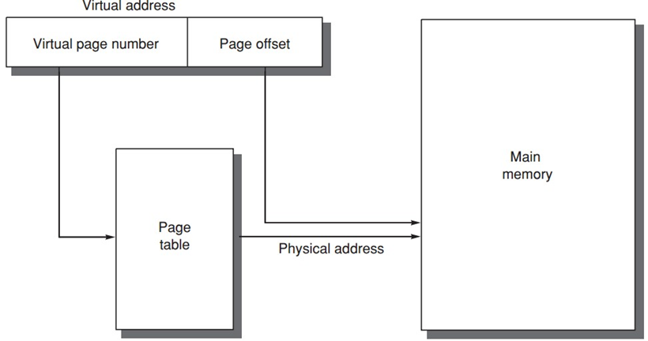
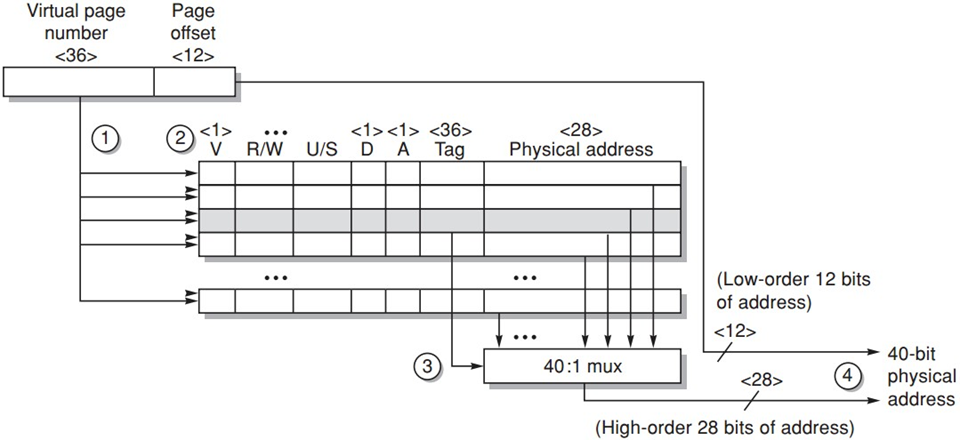
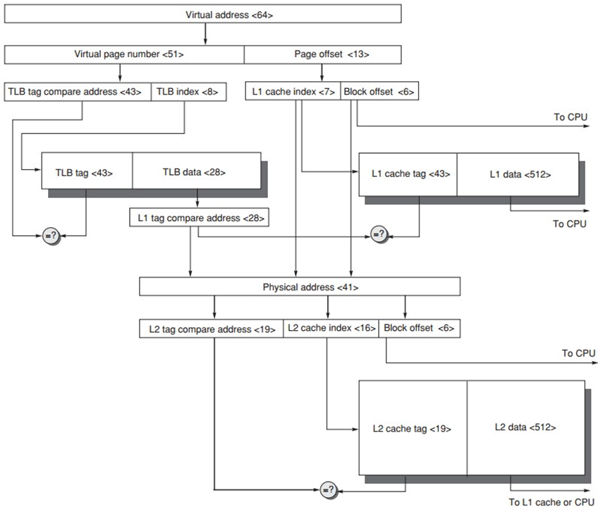

### Memory Hierarchy Virtual Memory

#### Virtual Memory Allocation

* Paged virtual memory
  * page: fixed-size block
  * Page address = (page number || offset) in 1 word
* Segmented virtual memory
  * segment: variable-size block
  * Segment address = (segment number)(offset) in 2 words

#### 4 Memory Hierarchy Questions

1. Where to place a block?
   * Fully associative strategy
2. How to find a block?
   * 
3. Which block to replace upon a virtual memory miss?
   * Least recently used (LRU) block
   * use/reference bit
4. What happens on a write?
   * Write-back strategy
   * Dirty bit

#### Address Translation

* Page table
* Translation lookaside buffer (TLB)
  * TLB entry
    * tag
    * data: physical page frame number, protection field, valid bit, use bit, dirty bit
    * example
      
* Page Size Selection
  * Larger
    * Smaller page table
    * allow larger cache with fast cache hit
    * More efficient to transfer from/to secondary storage
    * reduce TLB misses
  * Smaller
    * converse storage (less internal fragmentation)
  * Multiple
* Address Translation with cache
  

####  Multiprogramming

* Process
  * Time-sharing
  * context switch 
  * Maintain correct process behavior
* Process Protection
  * Proprietary page tables: having their own page table
  * Rings
  * Keys and Locks

