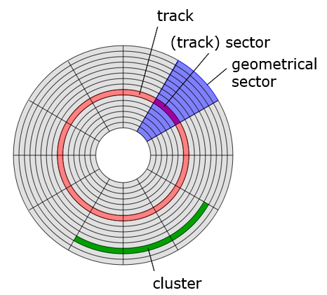

### Storage Systems Disk, RAID, Dependability

#### Disk

* sector
  * minimum storage unit
  * a block may span multiple sectors
* cluster
  * (dis)contiguous groups of sectors
  * may span more than one track
* track
  

#### Disk Arrays

* Striping: simply spreading data over multiple disks
* RAID: redundant array of inexpensive/independent disks
* RAID 0: no redundancy
* RAID 1: Mirroring
* RAID 2: Hamming code ECC word
* RAID 3: parity
  * even / odd parity: makes the # of 1 even / odd (包括parity)
* RAID 4
  * Favor small accesses
* RAID 5
  * Distributes the parity info across all disks in the array
* RAID 6
  * Row-diagonal Parity
  * Double-Failure Recovery

#### Dependability

* Failure, Error, Fault
  * The failure occurred because of an error
  * The cause of an error is a fault
  * fault -> latent (潜在) error
  * when error affects service -> failure
  * Fault -(one or more latent errors)-> Error -(activated to be effective->affect the delivered service)-> Failure
* Categories of Faults by Cause
  * Hardware faults
  * Design faults
  * Operation faults
  * Environmental faults
* Categories of Faults by Duration
  * Transient (短暂的) faults
  * Intermittent (断断续续的) faults
  * Permanent faults

