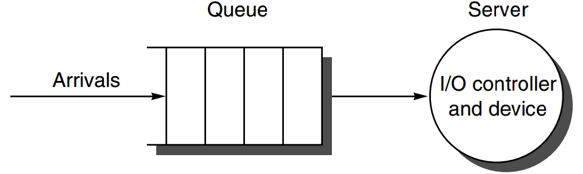

### Storage Systems Performance

#### I/O Performance

* Unique Measures
  * Diversity
  * Capacity
* Producer-Server Model
* Metrics
* Response time / Latency
  * the time a task from the moment it is placed in the buffer until the server finishes the task
* Throughput / Bandwidth
  * the average number of tasks completed by the server over a time period
* Competing demands
  * High throughput: buffer never be empty
  * Response time: empty buffer shrinks it
* Transaction time
  * Entry time: the time for the user to enter the command
  * System response time: the time between command entered and complete response displayed
  * Think time: the time from response reception to user entering next command
  * People need less time to think when given a faster response
* I/O Benchmarks

#### Queuing Theory

* Black Box Model
* Flow-balanced State
  * flow-balanced state
    * \# of tasks entering the system = \# of tasks leaving the system
    * necessary but not sufficient for steady state
  * steady state: the system has been observed for a sufficiently long time and 
    	mean waiting times stabilize
* **Little’s Law**
  * assumption: input rate = output rate
  * Mean number of tasks in system = Arrival rate $\times$ Mean response time
* Single-Server Model
  
  * Timeserver: average time to service a task
    * average service rate: 1/Timeserver
  * Timequeue: average time per task in the queue
  * Timesystem: average time per task in the system, or the response time
    * = Timeserver + Timequeue
  * Arrival rate: average # of arriving tasks per second
  * Lengthserver: average # of tasks in service
  * Lengthqueue: average length of queue
  * Lengthsystem: average # of tasks in system
    * = Lengthserver + Lengthsystem
* Server utilization: mean # of tasks being serviced divided by the service rate
  * Service rate: 1/Timeserver
  * Server utilization = Arrival rate $\times$ Timeserver (little's law)
* Queue Discipline
  * Timequeue = Lengthqueue $\times$ Timeserver + Mean time to complete the task being serviced when new task arrives if server is busy
  * Time $_{\text {queue }}=$ Time $_{\text {server }} \times \frac{\text { Server utilization }}{(1-\text { Server utilization })}$
  * $\begin{aligned} \text { Length queue } &=\text { Arrival rate } \times \text { Time server } \times \frac{\text { Server utilization }}{(1-\text { Server utilization })} \\ &=\frac{\text { Server utilization }^{2}}{(1-\text { Server utilization })} \end{aligned}$
* M/M/1 Queue
* M/M/m Queue: multiple servers
  * Utilization $=\frac{\text { Arrival rate } \times \text { Time }_{\text {server }}}{N_{\text {servers }}}$
  * Length queue $=$ Arrival rate $\times$ Time $_{\text {queue }}$
  * Time $_{\text {queue }}=$ Time $_{\text {server }} \times \frac{\left(\text { P}_{\text{tasks} \geq N_{\text {servers }}}\right)}{N_{\text {servers }} \times(1-\text { Utilization })}$

