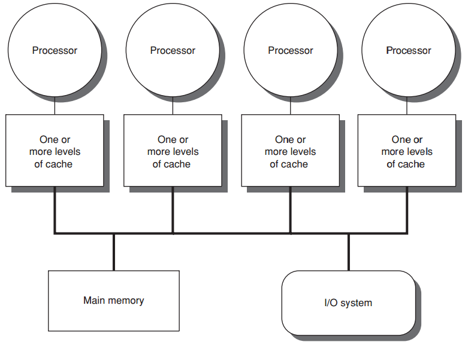
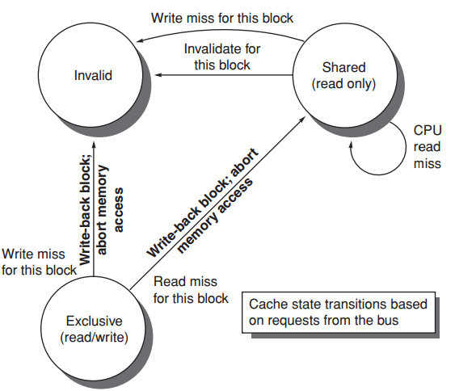
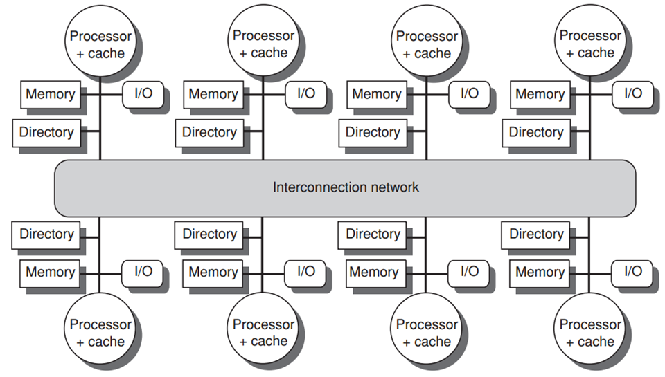
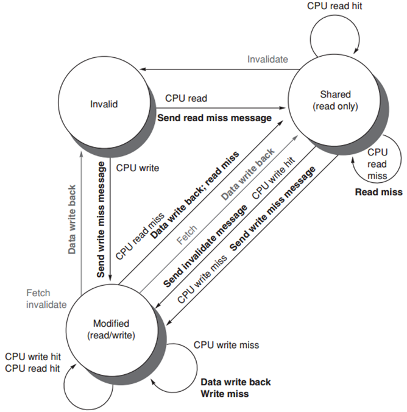
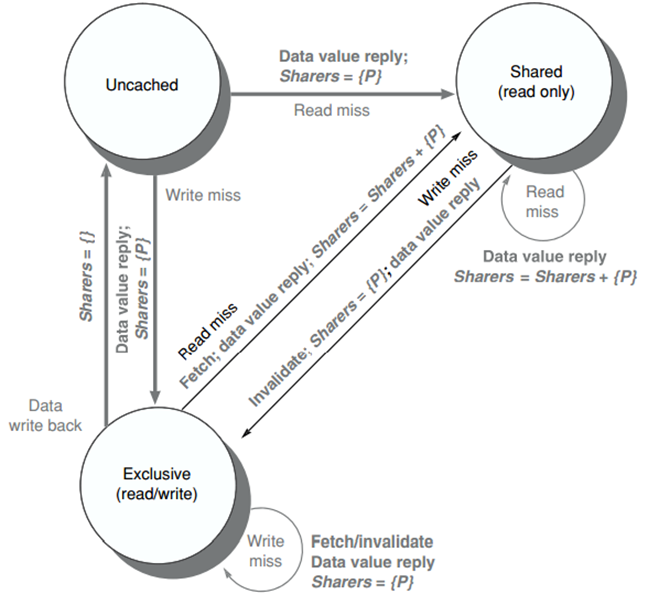

### Multiprocessors

#### Multiprocessor Architecture

* symmetric/centralized shared-memory multiprocessors (SMP)
  
* distributed shared memory multiprocessors (DMP)
  
* Limited Program Parallelism
  * Amdahl’s law

#### Centralized Shared-Memory Arch

* Cache Coherence Problem

  * Global state defined by main memory
  * Local state defined by the individual caches
  * Coherent: any read of a data item returns the most recently written value of that data item
    * coherence: defines what values can be returned by a read
    * consistency: determines when a written value will be returned by a read
  * Coherence Property (3 properties)
    * write -> read: returns written value (*same processor*)
    * write -> read: returns written value (*different processors, sufficiently separated*)
    * Write serialization: 2 writes by 2 processors are seen in the same order

* Cache Coherence Protocols

  * Directory based
  * Snooping

* Snooping Coherence Protocol

  * Write invalidation protocol: invalidates other copies on a write

  * Write update/broadcast protocol

* MSI
  * 3 Block states: invalid, shared, modified
  * Requests from CPU
    
  * Requests from bus
    
  * MSI Extensions
    * MESI (exclusive)
    * MOESI (owned)
* Coherence Miss
  * True sharing miss
    * first write by a processor to a shared cache block causes an invalidation to establish ownership of that block; 
    * another processor reads a modified word in that cache block;
  * False sharing miss
    * occurs when a block is invalidated (and a subsequent reference causes a miss) because some word in the block, other than the one being read, is written into

#### Distributed shared memory and directory-based coherence

* Each **directory** tracks the caches that share the memory addresses of the portion of memory in the node; 
* Directory-based Cache Coherence Protocol
  * States
    * Shared
    * Uncached
    * Modified
  * State transition for cache block
    
  * State transition for directory
    

