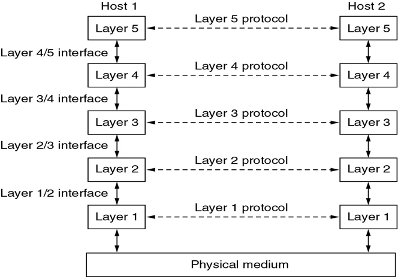
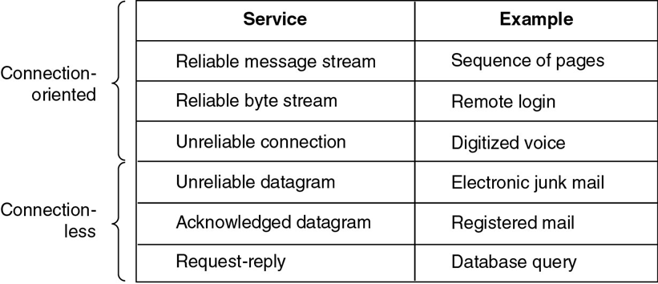
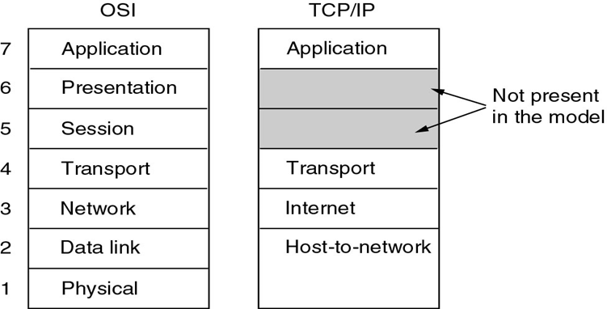
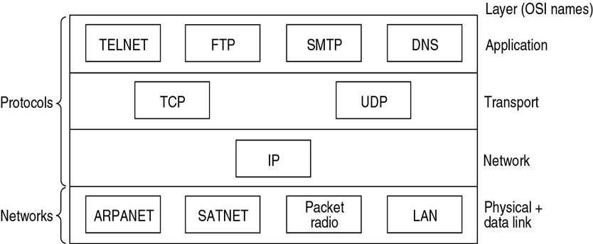
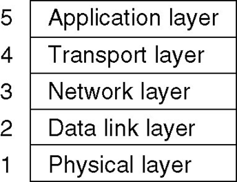

### Chapter 1  Introduction

#### Uses of network

* Business applications
* Home applications
  * Person-to-person communication
  * E-commerce
* Mobile

#### Network hardware

* Two Types of Transmission Technology
  * Broadcast links, broadcast networks
    * broadcasting: packets received and processed by every machine on the network
    * multicasting: support transmission to a subset of the machines
  * Point-to-point links, point-to-point networks
    * unicasting
* Classifying Network (about Scale)
  * PAN - Personal
  * LAN - Local
  * MAN - Metropolitan
  * WAN - Wide
* Wireless networks
  * System interconnection
    * Bluetooth
    * master-slave mode
  * Wireless LANs: 802.11
  * Wireless WANs: 802.16
* Internetworks

#### Network Software

* Protocol Hierarchies

* Design issues
  * Addressing
  * Error Control
  * Flow Control
  * Multiplexing
  * Routing
* Connection-Oriented and Connectionless Services

*  Service Primitives

#### Reference Models

* The OSI Reference Model
  * 

* The TCP/IP reference model
  
  * The most important two protocols: IP (Internet Protocol), TCP (Transmission Control Protocol)
  - UDP (User Datagram Protocol)
  - FTP (File Transfer Protocol), DNS (Domain Name System), 
  - TELNET(Virtual Terminal), SMTP (Simple Mail Transfer Protocol)

* Hybrid reference model

#### Example Networks

##### The Internet

* The ARPANET
* NSFNET
* Internet Usage
  * Traditional applications
  * WWW

* Architecture of the Internet