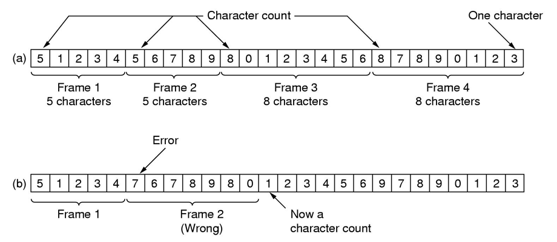
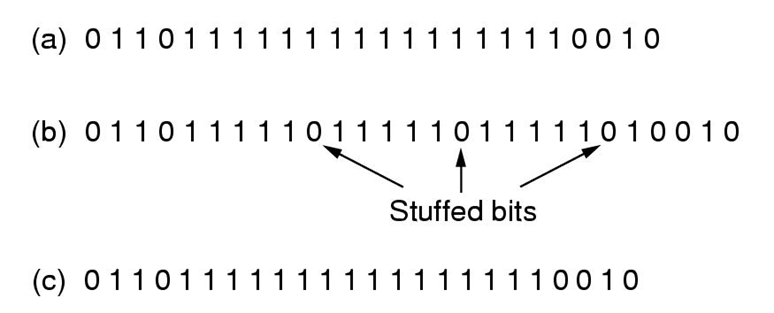
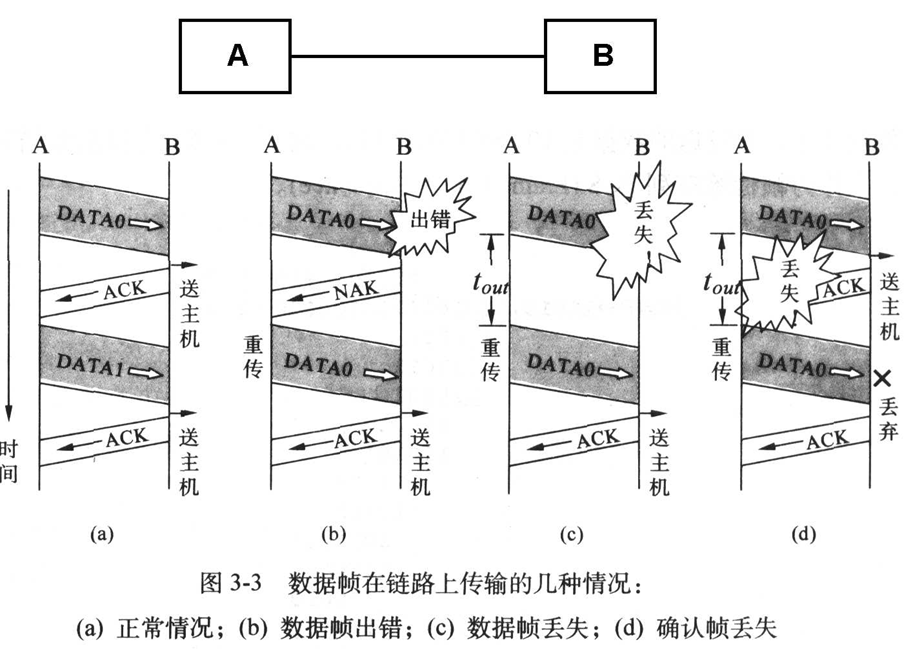
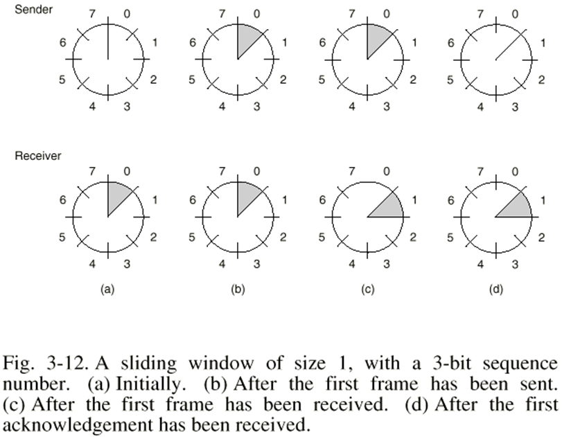
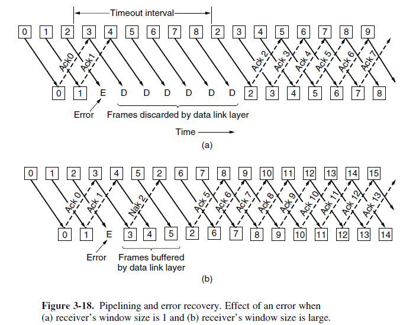
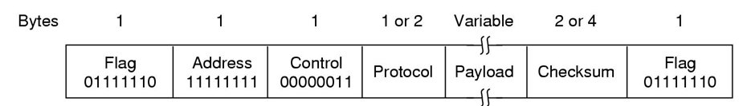

### Chapter 3  Data Link Layer

#### Design Issues

* Frame: Data Link Layer PDU (Protocol Data Unit)
  
* Error / Flow control
* Services
  * Unacknowledged / Acknowledged connectionless service
  * Acknowledged connection-oriented service
* Framing
  * Character count
    
  * Byte stuffing or character stuffing
    * having each frame start and end with special character
    * FLAG -> ESC FLAG; ESC -> ESC ESC
  * Bit stuffing (flag: 01111110)
    
  * Physical layer coding violation
    * Manchester encoding
      
* Error Control
  * Error detection / correction
  * Repeated data frame
  * Lost frame
  * Timer
* Flow Control
  * feedback_based flow 
  * rate_based flow control

#### Error detection and correction

* Error correcting codes (Hamming)
  * Hamming distance of 2 (A and B): number of 1's in A xor B (i.e. number of different bits in A and B)
  * Hamming distance of a list: minimum 2 in the list
  * D(a,c) <= D(a,b) + D(b,c)
  * 纠正d比特错, 需距离为2d+1比特的编码
* Error-detecting codes (CRC)
  * (r+1)-bits generator $G(x)$: degree r
  * 被除数: m bits + r bit 0
  * checksum: 被除数 mod G(x), r bits
  * 除法时，无进位减法
  * r阶的多项式能够检测所有长度<=r的突发错误, 长度大于r+1的错误漏检的 概率为(1/2)^r

#### Elementary Data Link Protocol

* Unrestricted simplex protocol (Utopia, Protocol 1)

* Simplex stop-and wait protocol (Protocol 2)

* Simplex protocol for noisy channel (Protocol 3)

  * PAR (Positive Acknowledgement Retransmission), ARQ(Automatic Repeat reQuest)

    

#### Sliding Window Protocol

* 1-bit sliding window protocol (Protocol 4)
  
  
* A Protocol Using Go Back n (Protocol 5)
  
  * Send / Receive Window size = MAX_SEQ
* A Protocol Using Selective Repeat (Protocol 6)
  * Send / Receive Window size = (MAX_SEQ + 1) / 2

#### Example Data Link Protocols

* HDLC (High-level Data Link Control)
  * bit-oriented protocol
  * frame format
    
  * Minimum frame: 32 bits
  * Control field (3 kinds)
    
* The Data Link Layer in the Internet
  * PPP (Point-to-Point)
    
    * Address and control bytes can be saved

