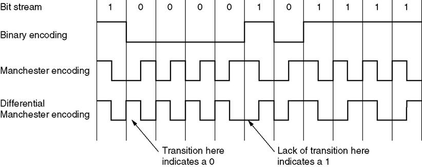
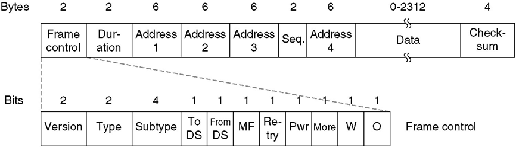

### Chapter 4  The Medium Access Control Sublayer

#### The Channel Allocation Problem

- Static Channel Allocation in LANs and MANs
  - mean time delay (发送时间＋排队时间) $T = 1 / (\mu c-\lambda)$
    - c: network speed (bps), $\lambda$: arrival rate (frames/s), $1/\mu$: frame length (bit/frame)
    - Poisson arrival and service time
  - The mean time delay in FDM $T_{FDM} = N\times T = N / (\mu c-\lambda)$
    - N: # of subchannels
- Dynamic Channel Allocation in LANs and MANs
  - 5 key assumptions
    - Station model
    - Single channel model
    - Collision assumption
    - Continuous / Slotted time
    - Carrier / No carrier sense

#### Multiple access protocols

##### ALOHA

* Pure ALOHA
  * Idea
    * let users transmit whenever they have data to be sent. Assumed: Fixed frame length
    * After collision, waiting for random time, then retransmit
    * Vulnerable period for the shaded frame
  * The throughput of system $S=Ge^{-2G}$
    * G: load (frame numbers per frame time), S: Successfully transmitted frames per frame time
    * $\max S = 1 /(2e) \approx 0.184$ when G = 0.5
      * Best channel utilization: 18%
* Slotted ALOHA
  * divide time into discrete intervals ,each interval corresponding to one frame
  * Danger of collision reduce a half
  * $S = Ge^{-G}$
    * $\max S = 1/e \approx 0.368$
      * Best channel utilization: 37%

##### Carrier Sense Multiple Access Protocols

* persistent and non-persistent CSMA
  * 1-persistent CSMA
  * Non-persistent CSMA
  * p-persistent CSMA 

* CSMA with Collision Detection
  
  * Three states: contention, transmission, or idle

##### Wireless LAN Protocols

* Each cell has only one channel, covering the entire available bandwidth, usually 11Mb/s-54Mb/s
* Problems
  * Hidden station problem
  * Exposed station problem
    
* Multiple Access with Collision Avoidance (MACA)
  * the sender stimulate the receiver (RTS), make it send a frame (CTS), all stations nearby can detect this transmission, avoid collision
  * MACAW

#### Ethernet

* Cabling
  
  * Cable topologies: (a) Linear, (b) Spine, (c) Tree, (d) Segmented
* Manchester Encoding
  
* The Ethernet MAC Sublayer Protocol
  * Original DIX (DEC,Intel,Xerox) frame structure
    * minimum frame length: 64 bytes
      
      * Header: 18 bytes, pad: 0-46 bytes
  * two changes IEEE made
    
* The Binary Exponential Backoff Algorithm
  * delay = k * 2$\tau$
    * $2\tau$: slot time (51.2$\mu s$)
    * k = random(0, $2^i-1$) after i collisions (i$\leq$10)
    * after 10 collisions, frozen at 1023
    * after 16 collisions, fail
* Ethernet Performance
* Switched Ethernet
  * Hub: 10 / 8 = 1.25 Mbps
  * Switch: 10 / 2 = 5 Mbps
* Fast Ethernet
  * 802.3u
  * Wire
    * Category 3 twisted pair: 100Base-T4
    * Category 5 twisted pair: 100Base-TX
      * 4B/5B
    * Fiber: 100Base-FX
  * Hub
    * Shared hub is used for: 100Base-T4, 100Base-Tx
    * Switched hub is used for: 100Base-T4, 100Base-Tx, 100Base-Fx
* Gigabit Ethernet
  * 802.3z

#### Wireless LANs

* 802.11
* Physical Layer
  * FHSS
  * DSSS
  * OFDM
  * HR-DSSS
  * 802.11g
* Sublayer Protocol
  * hidden / exposed station problem, Half duplex
  * 2 modes
    * DCF (Distributed Coordination Function)
    * PCF (Point Coordination Function)
  * CSMA/CA (CSMA with Collision Avoidance)
* Frame Structure
  
* Services: 9
  * Distribution services (5)
  * Intracell Services (4)

