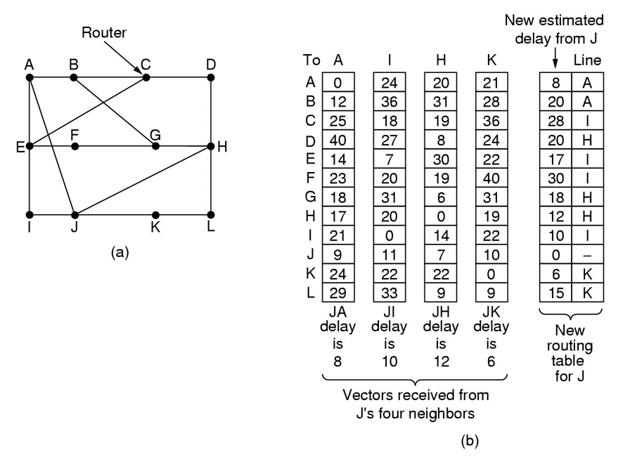
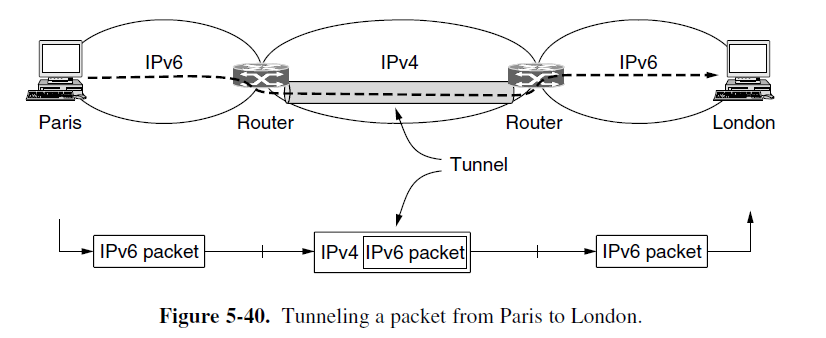
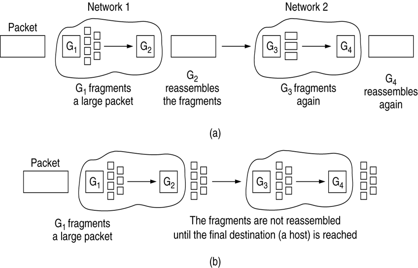
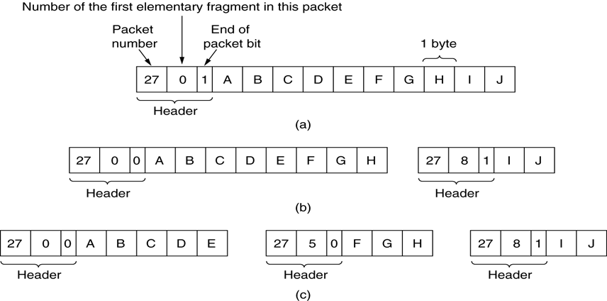
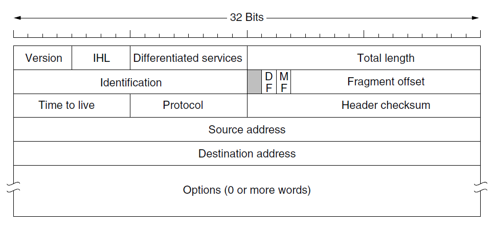
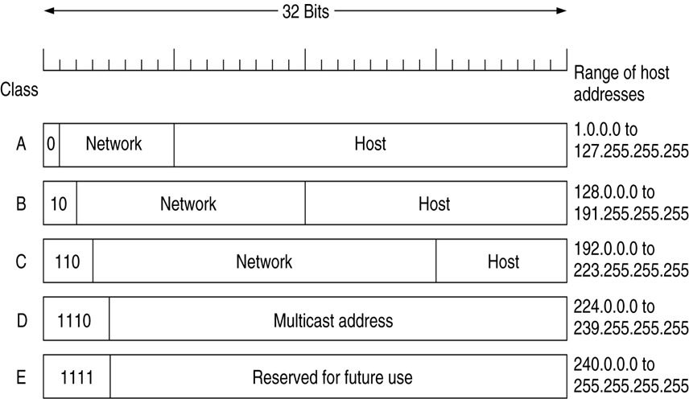
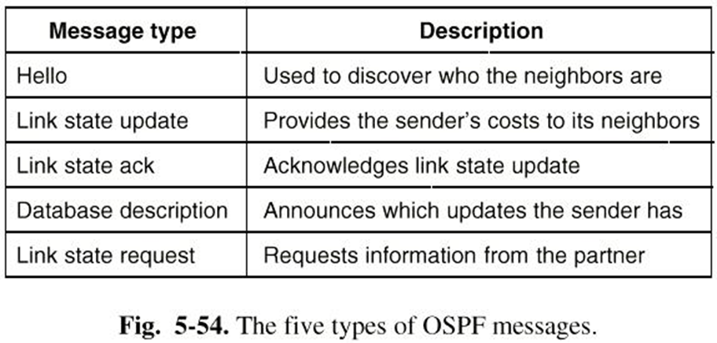

### Chapter 5  The Network Layer

* is the lowest layer that deals with end-to-end transmission

#### Design issues

* Store-and-Forward Packet Switching
* Services provided to the transport layer
  * Connection-oriented AND Connectionless service
* Implementation of Connectionless Service
  * Datagram subnet
* Implementation of Connection-Oriented Service
  * Virtual circuit (VC)
* Comparison of VC and Datagram subnets
  * Route table of VC is larger
  * Setup time (VC) VS address parsing time (Datagram)
  * VC: avoiding congestion, but vulnerability problem

#### Routing Algorithms

* The optimality principle

  * If router J is on the optimal path from router I to router K, then the optimal path from J to K also falls along the same route
  * sink tree
* Shortest path (Dijkstra)
* Flooding
* Distance Vector Routing

  * RIP (Routing Information Protocol)
    
  * The count-to-infinity problem
* Link state routing

  * Distance Vector Routing’s problem 

    * Not taking bandwidth into account
    * Take too long time to converge

  * Principle for each router

    1. Discover its neighbors and learn their network address
    2. Measure the delay or cost to each of its neighbors
    3. Construct a packet telling all it has just learned
    4. Flood this packet to all other routers
    5. Compute the shortest path to every other router
* Hierarchical routing 

#### Internetworking

* How Networks Differ
* How Networks Can Be Connected
  * Networks can be interconnected by different devices
  * Routing in network layer differs from switching in the data link layer
    * destination address: IP versus MAC 
    * Route table versus forward table in MAC sublayer 
* Concatenated Virtual Circuits
* Connectionless Internetworking
  * more potential for congestion
  * robust in the face of router failure
  * longer header
* Tunneling: Handling the general case of making two different networks interwork
  * The WAN can be seen as a big tunnel extending from one **multiprotocol router** to the other
  * 
* Internetwork Routing
  * A two-level routing algorithm
    * Interior gateway protocol (自治系统)
    * Exterior gateway protocol
    * AS (autonomous system)
* Fragmentation (break up packets in fragments)
  * Transparent fragmentation
  * Nontransparent fragmentation
    
  * numbering system 
    

#### The Network Layer in the Internet

* IP Protocol
  * IP datagrams: Header+Text
  * Header (20+ byte)
    
    * Total length: <= 65535 bytes
    * DF: don't fragment, MF: more fragments
    * Fragment offset: 前面fragment长度除以8 (All fragments except the last one in a datagram must be a multiple of 8 bytes)
* IP Addresses
  * Formats (5 types: A B C D E)
    
  * Specific IP addresses
    
  * Subnet
    * Subnet mask
      * e.g. 255.255.252.0 or /22 (前22位一样)
    * CIDR
      * longest matching prefix: if there is a match for a /20 mask and a /24 mask, the /24 entry is used
  * NAT (Network Address Translation)
    * 3 ranges
      * 10.0.0.0----10.255.255.255/8 (16,777,216 hosts)
      * 172.16.0.0----172.31.255.255/12 (1,048,576 hosts)
      * 192.168.0.0--192.168.255.255 /16 (65536 hosts)
* Internet Control Protocols
  * ICMP: When something unexpected occurs during packet processing at a router, the event is reported to the sender by the ICMP (Internet Control Message Protocol).
  * ARP: IP->MAC
  * RARP: MAC->IP
  * BOOTP
  * DHCP: The Dynamic Host Configuration Protocol
* Label Switching and MPLS
  * MPLS adds a label in front of each packet, and forwarding is based on the label rather than on the destination address
* OSPF (Open shortest path first): The interior gateway routing protocol
  * a link state protocol
  * AS (自治系统) 划分为多个 areas
    * backbone area: 连接所有其他区域
    * backbone router: routers in backbone area
    * area border router
    * AS boundary router
  * OSPF Works by exchanging information between adjacent routers to update routes. Adjacent routers are not the same as neighboring routers.
  * Designated router: one router is elected as the designated router. It is said to be adjacent to any router on the LAN and exchange information with them.  neighboring routers that are not adjacent don’t exchange information.
  * OSPF messages
    
* BGP (Border gateway protocol): The Exterior GateWay Routing Protocol
  * a distance vector protocol
  * Keeps track of the exact path used
    
    * routing information from I and E are discarded because they pass through F itself.
* Internet Multicasting
  * send to a large number of receivers simultaneously 
  * class D addresses

