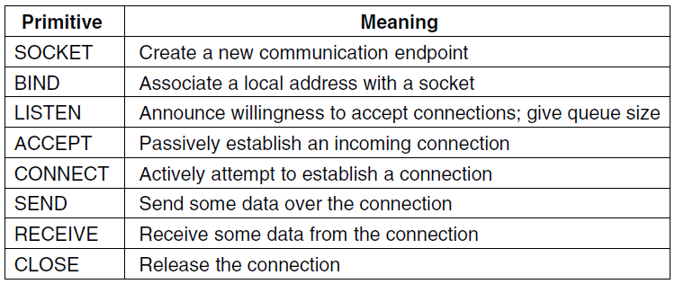
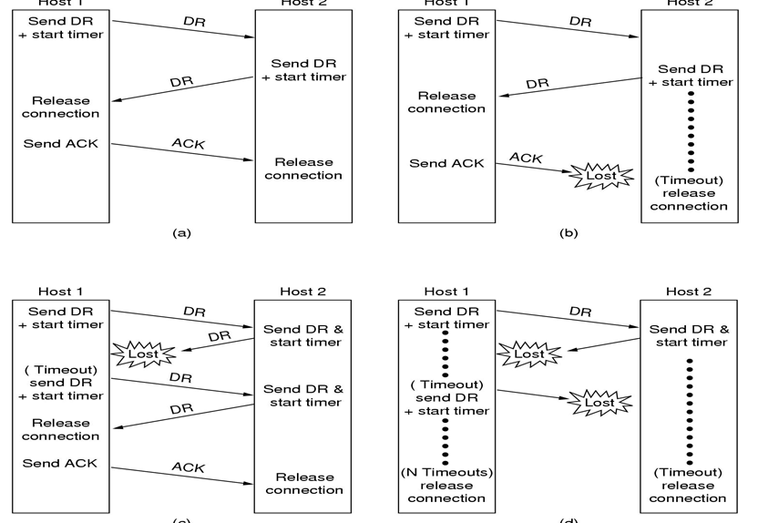
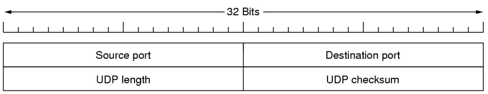
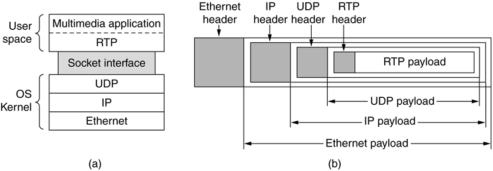
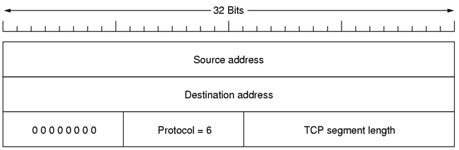
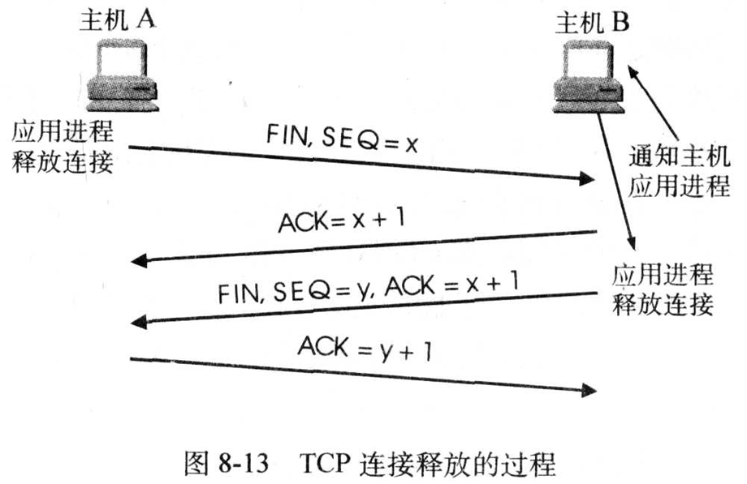
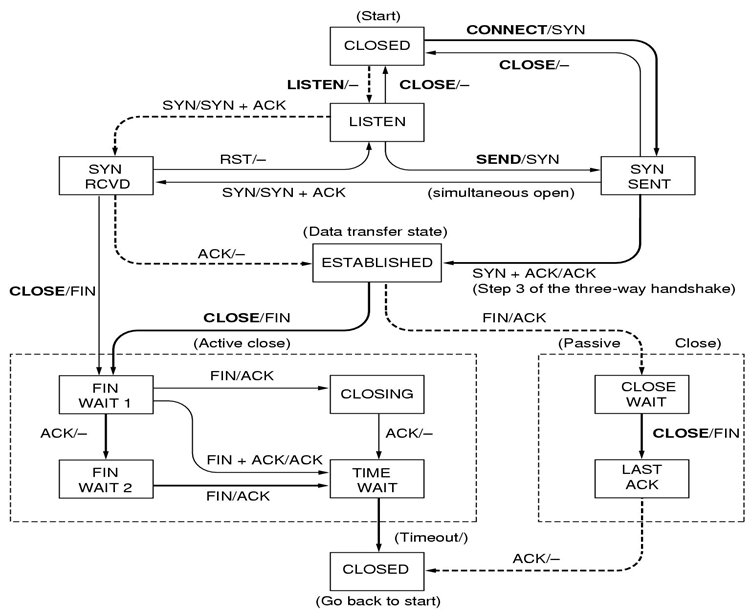
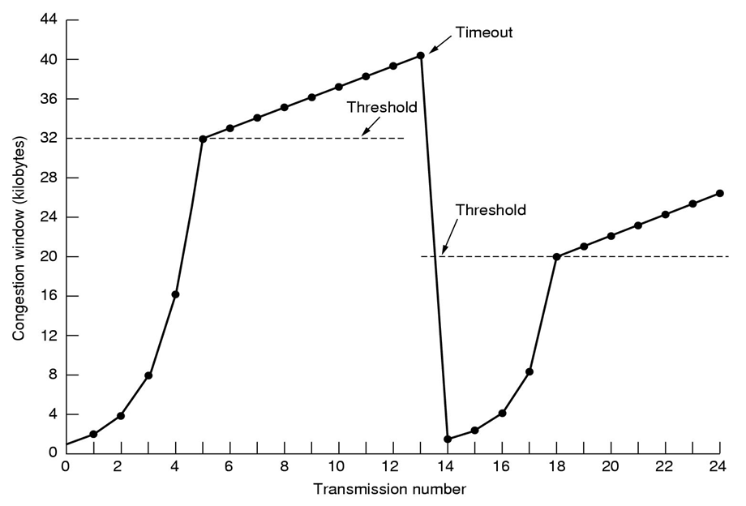

### Chapter 6  The Transport Layer

#### The Transport Service

* Service Provided to the Upper Layers
  * goal: efficient, reliable, and cost-effective service to application processes
  * Types of transport service
    * Connection-oriented, 3 phases: establishment, data transfer, and release
    * connectionless
* Transport Service Primitives
  * Network VS Transport
    * Network: unreliable, object: transport entity
    * Transport: (connection-oriented) reliable, object: application program
  * Transport Protocol Data Unit (TPDU)
  * Nesting of TPDUs, packets, and frames
    
* Disconnection
  * Asymmetric: one side does a disconnection, and the entire connection is closed
  * Symmetric: each side does a disconnection, one direction of connection is closed
* Berkley Sockets (for TCP)
  
  * Block: accept, receive; Not block: others

#### Element of Transport Protocols

* Connection Establishment
  * Two-way handshake will result in half-connection (一边连接一边不连接)
  * Solution: three-way handshake
    
* Connection Release
  * 2 styles: Asymmetric (may data loss) / Symmetric
  * Two-army problem
    * In practice, three-way handshake is used
      

#### UDP

* Introduction
  * connectionless transport protocol: UDP (User Data Protocol)
  * 8-byte header 
    
  * Doesn't do: flow / error control, retransmission on bad segment
  * Application: client-serer situation (short request); DNS
* Remote Procedure Call (RPC)
  * Allowing programs to call procedures located on remote hosts
  * Steps
    
  * Problems
    * Passing pointers is almost impossible 
    * Problem in weakly-typed languages, like C
    * difficult to deduce the types of the parameters (e.g. `printf`)
    * global variables
  * The Real-Time Transport Protocol (RTP)
    
    * Header
      
      * CC: # of contributing resources
      * Payload type: encoding algorithm
    * RTCP

#### TCP

* Introduction
  * connection-oriented: reliable end-to-end byte stream over an unreliable internetwork
  * entity: TCP streams and interfaces to the IP layer
* Service Model
  * Socket
  * Socket number (Address): the IP address + port (16bits)
    * Well known ports (< 1024)
      
  * connections: full-duplex ,point-to-point, a byte stream, not support multicasting or broadcasting
  * may buffer, or may send immediately (PUSH flag)
  * Urgent data (URG flag)
* The TCP Protocol
  * The form of data exchange: segment
  * fixed 20-byte header + (optional) + data bytes
  * segment max size < min (65515, MTU - 20)
    * MTU: Maximum transfer unit, usually 1500
  * Basic: sliding window protocol
* The TCP Segment Header
  * fixed 20-byte header + (optional) + (0-N) data bytes
    * N = 65535 - 20 (IP) - 20 (TCP) = 65495
  * 
  * Checksum (use pseudo header)
    
    * 16位反码和的反码 (不足16位零填充)
* TCP Connection Establishment
  * three-way handshake
    * Server: LISTEN, ACCEPT
    * Client: CONNECT
* TCP Connection Release
  * both sides need to send total 4 or 3 segment
    
* TCP Connection Management Modeling
  * 11 states
  * State Diagram
    
* TCP Transmission Policy
  * When the windows is 0, the sender may not normally send segments
    
    * except urgent segment or 1-byte segment (window probe)
    * Worst case: 41+40+40+41
      * Solution: delayed acknowledgements
    * Nagle’s algorithm
  * Silly window syndrome
    * Nagle solves problem: sending application delivers TCP data a byte at a time.
    * Clark solves problem: receiving application sucks TCP data up a byte at a time.
* TCP Congestion Control
  * detect: losing packet and timeout indicate occurring of congestion
  * Two potential problems
    * Network’s capacity
    * Receiver’s capacity
  * Each sender maintains two windows
    * window receiver has granted
    * Congestion window: network capacity
    * Sender window size = minimum of 2
  * Slow start algorithm: determine congestion window size
    1. Initial: size = size of max segment. When acknowledgement to this segment arrives, size = size * 2
    2. When all sent segments belonging to the congestion window acknowledged, size = size * 2
    3. size grows exponentially until reaching window size granted by receiver
    4. Timeout occur, stop growing
    5. Threshold: after reaching threshold, grow linearly. Timeout occur, threshold = half of current size
       
* TCP Timer Management
  * Retransmission timer
  * Dynamic algorithm
  * $RTT=\alpha\times RTT + (1-\alpha)\times M$
    * M: measured round-trip time; $\alpha$: typical value (e.g. 7/8)
  * Early: $Timeout = \beta\times RTT$, where $\beta=2$
  * Present:
    * $Timeout = RTT + 4\times D$
    * $D= \alpha\times D+(1-\alpha)\times|RTT-M|$

