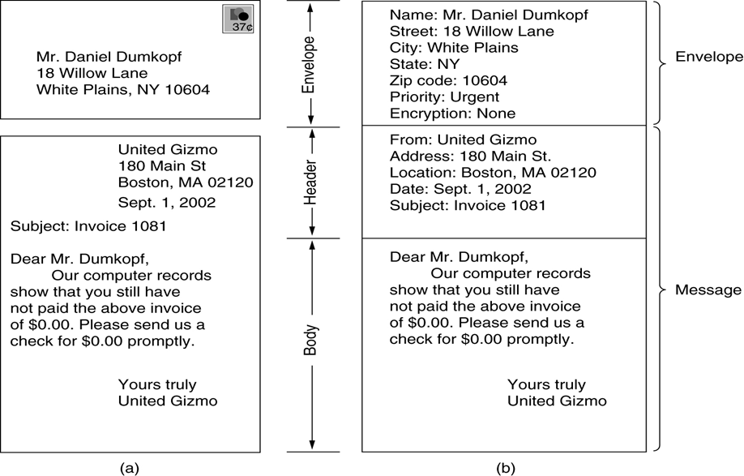
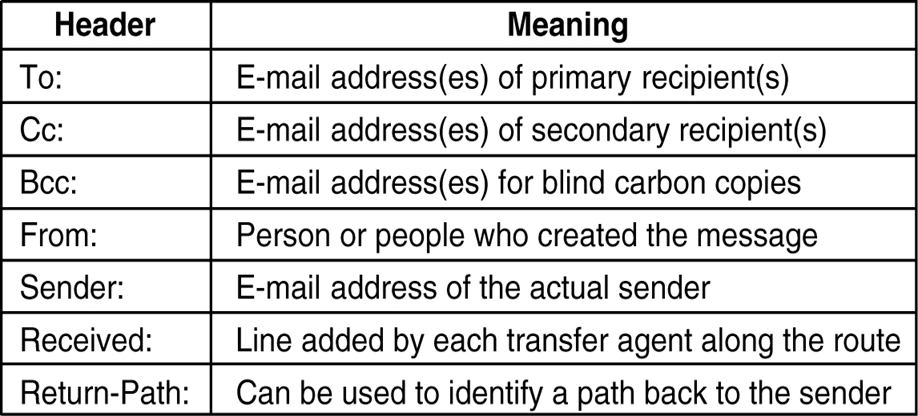
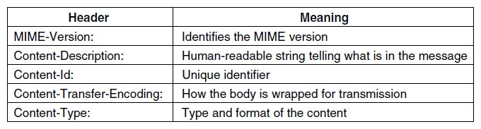
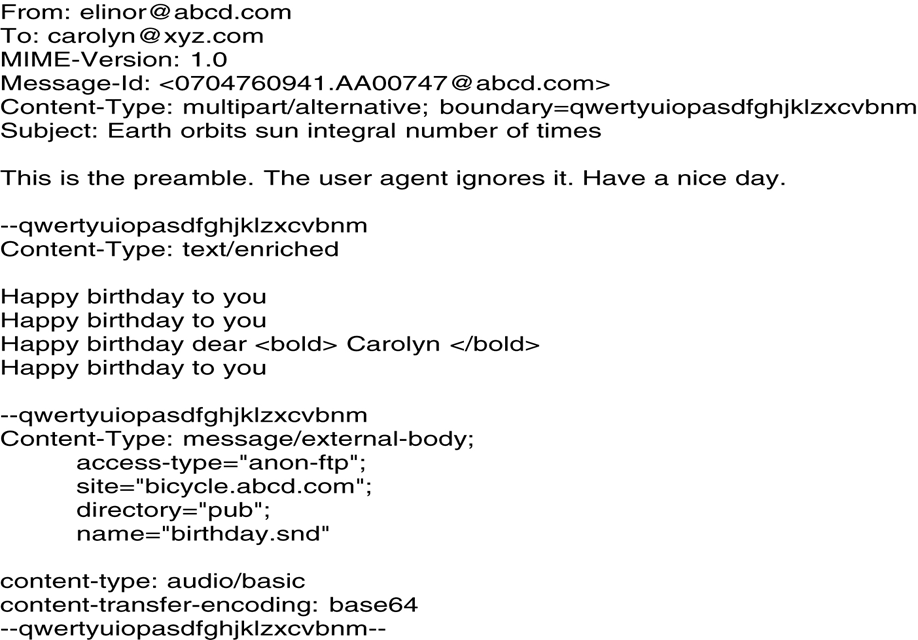
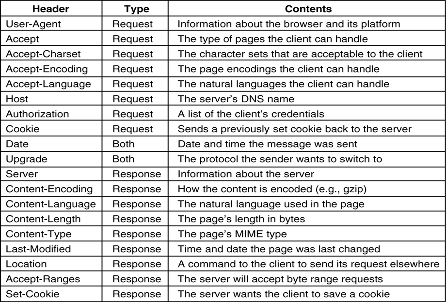
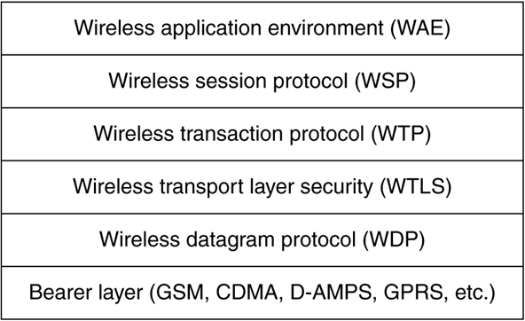

### Chapter 7  The Application Layer

#### DNS (Domain Name System)

* The way DNS is used
  * application program calls a library procedure called the **resolver**
  * The resolver sends a UDP packet to a local DNS server, which then looks up the name and returns the ip address to the resolver
  * The resolver then returns it to the caller
* The DNS Name Space
  * Generic
  * Countries
* Resource Records
* The format of Resource Records: Domain_name, Time_to_live, Class, Type, Value
  * Type (most important: A)
    
* Name Server
  * The DNS name space is divided up into nonoverlapping zones
  * The process of looking up a remote name: recursive query
  * LDAP (Light-weight Directory Access Protocol)

#### Electronic mail

* Main protocols
  * ARPANET: RFC 821(transmission protocol) and RFC 822 (message formats)
  * CCITT X.400 ->OSI: MOTIS. Now, X.400 has almost disappeared.
* Architecture and Services
  * 2 subsystems
    * user agents
    * message transfer agents
  * Basic functions
    * Composition, transfer, reporting, displaying, disposition, others
  * Message inside envelop: header + body (a) paper mail (b) email
    
  * 
* User Agent
  * Sending
    * DNS address: mailbox@location
    * Mailing lists
  * Reading
    * Displaying the mailbox content
    * Typical mail handling commands
      * Display, send, Manipulate the mailbox, Move about in the current mailbox, Exit
* Message Formats
  * RFC 822 (ASCII format)
    * a primitive envelope + header fields + a blank line + message body
      * RFC 822 don’t distinguish envelop from header
      * use some header field to construct envelop
    * Header fields (related to transport)
      
    * Header field (others)
      
  * MIME (Multipurpose Internet Mail Extensions)
    * Still use the RFC 822 format, but to add structure to the message body and define encoding rules for non-ASCII messages
    * 5 new headers
      
    * Binary message encoding: base64 encoding
      * group of 24bit -> four 6-bit units
      * 6-bit unit -> 8-bit ASCII
        * 00->A, 26->a, 52->0, 62->+, 63->/
        * 再用两个连在一起的等号“==”和一个等号“=”分别表示最后一组的代码只有8或16比特
    * MIME types and subtypes (defined in RFC 2045)
    * A multipart message containing enriched and audio alternatives
      
* Message Transfer
  * SMTP (Simple Mail Transfer Protocol)
    * A simple ASCII protocol
    * port：25
    * TCP connection
    * 步骤
      * telnet xxx 25
      * HELLO
      * MAIL FROM
      * RCPT TO
      * DATA (用单独的一个点(.)表示数据结束)
      * QUIT
    * ESMTP (extended SMTP)
* Final Delivery
  * POP3 (Post Office Protocol)
    * port: 110
    * 步骤
      * telnet xxx 110
      * USER / PASS
      * RETR (retrieve)
      * DELE (delete)
  * Interactive Mail Access Protocol (IMAP)
    * The email server maintains a central repository that can be accessed from any machine
    * mail on server usually are not copied to client machine
  * Comparison
    

#### The World Wide Web

* Architectural Overview
  * The Client Side
    * Hypertext, Browser, Hyperlink, Hypermedia, Bookmark
    * TCP connection
    * two methods for browser to interpret file types (PDF, jpeg, etc.)
      * plug-ins (浏览器插件) : a code module installed in a special directory
      * helper application : a complete program, mainly use MIME type “application” , but other types are possible
  * The Server Side
    * listening to TCP port 80
    * HTTP protocol: legal requests and replies (ASCII protocol)
    * Every request requires making a disk access to get the file
      * Cache, multithread, and Server farm used to provide higher access ability
    * URL (Uniform Resource Locator)
      * Consists of: protocol, DNS name, file path (empty file name defaults to main home page)
      * Common protocols
        
    * Cookies
      * 5 fields: domain, path, content, expire, secure
* Static Web Document
  * HTML (HyperText Markup Language)
  * FORM (表单)
    * GET (CGI程序从环境变量 QUERY_STRING 获取上传数据)
    * POST (CGI程序从stdin(标准输入)获取上传数据)
  * XML and XSL
  * XHTML
* Dynamic Web Documents
  * Server-Side Dynamic Web Page Generation
    * Common Gateway Interface (CGI): a standardized interface to allow Web Server to talk to back-end programs and scripts that can accept input (e.g. from forms) and generate HTML pages in response
    * Perl Scripts: in cgi-bin directory
    * Hypertext Preprocessor (PHP): open source
    * Java Server Pages (JSP): Sun
    * Active Server Pages(ASP): Microsoft
  * Client-Side Dynamic Web Page Generation
    * tag script (HTML 4)
    * JavaScript
    * Applets: Java
    * ActiveX: Microsoft
* HTTP
  * ASCII request, RFC 822 MIME-like response
  * defined in RFC 2616
  * Connections: a TCP connection to port 80 (HTTP 1.1 supports persistent connections)
  * Method
    
  * Response
    
  * Message headers
    
* Performance Enhancements
  * Caching (client-side)
    * Squirreling (储存) away pages for subsequent use
    * The usual procedure is for some process, called proxy, to maintain the cache.
      * local proxy (in browser)
      * A machine shared by all hosts in LAN
      * A proxy server in ISP
    * evict
  * Server Replication
    * mirroring site
  * Content Delivery Networks
    * redirect the client’s request to the nearest CDN server
    * Working model
      * tiny pages (just HTML text) are stored on the content provider’s server
      * large files (images, audio, video) are distributed by the CDN
      * 
* The Wireless Web
  * WAP (Wireless Application Protocol)
    * WAP 1.0: 9600 bps
    * Protocol Stack
      
    * WML (on-the-fly filter from HTML to WML)
  * I-Mode (information-mode)

