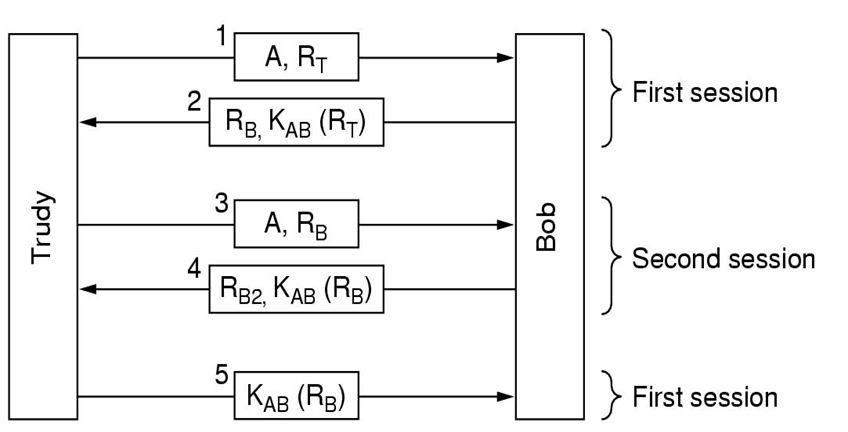
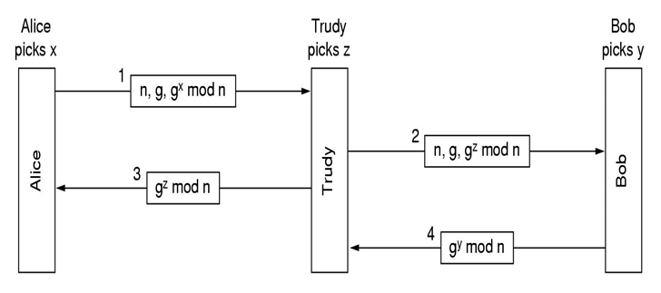

### Chapter 8  Network Security

#### Cryptography

* Two Fundamental Cryptographic Principles
  * All encrypted messages must contain some redundancy. 
  * Some measures must be taken to ensure that each message received is the latest one (not a repeated one).

#### Symmetric-Key Algorithms

* DES
  * 56-bit key (+8-bit 奇偶校验)
  * 19 stages
* AES
  * Key length: 128, 192, 256 bits

#### Public-Key Algorithms

$D_{SK}(E_{PK}(P))=P$

* RSA

#### Digital Signatures

* Public-Key Signatures
* Message Digests

#### Management of Public Keys

* Certificates

#### Communication Security

#### Authentication protocols

* The reflection attack
  
* The Diffie-Hellman key Exchange
  * passing queue attack (also called bucket brigade attack or man-in-the-middle attack)
    
* KDC (Key Distribution Center)

#### E-mail Security

* PGP – pretty good privacy
  

