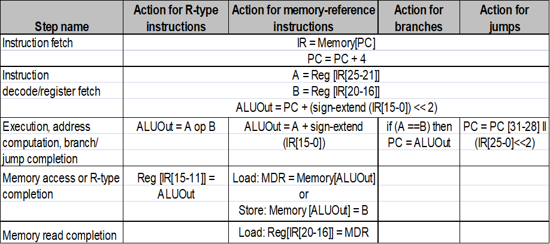
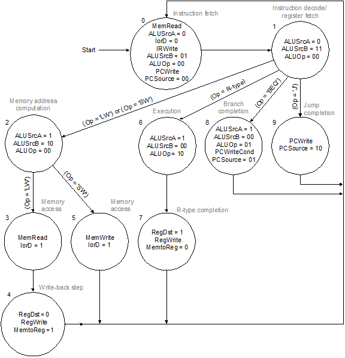
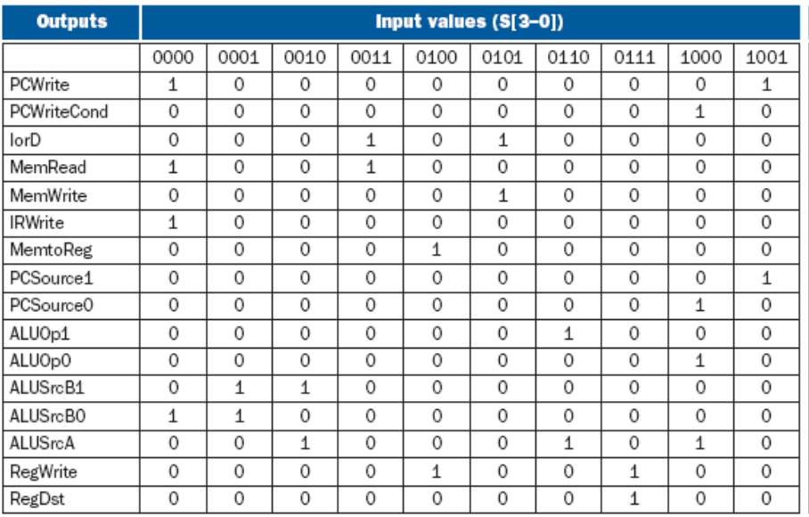
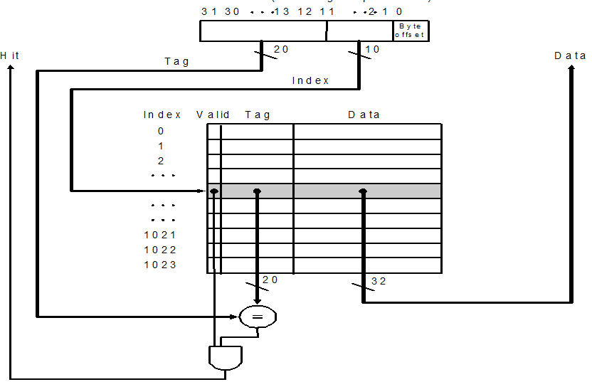
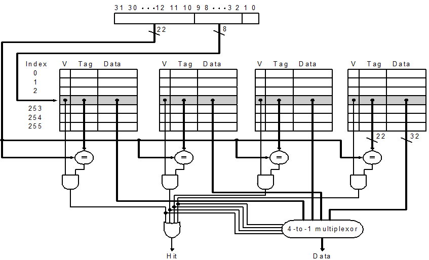
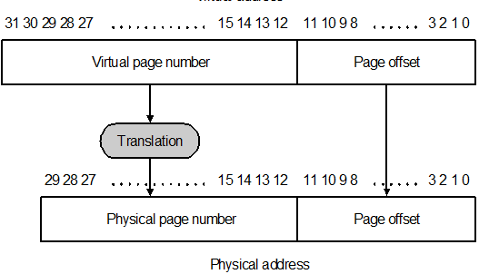
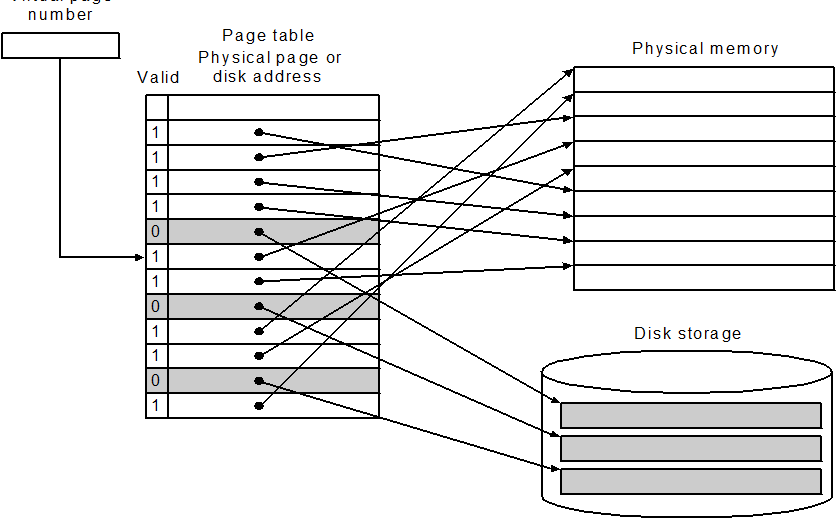
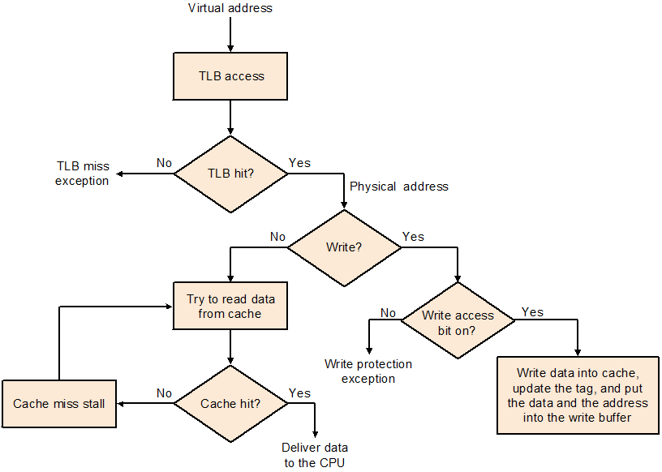
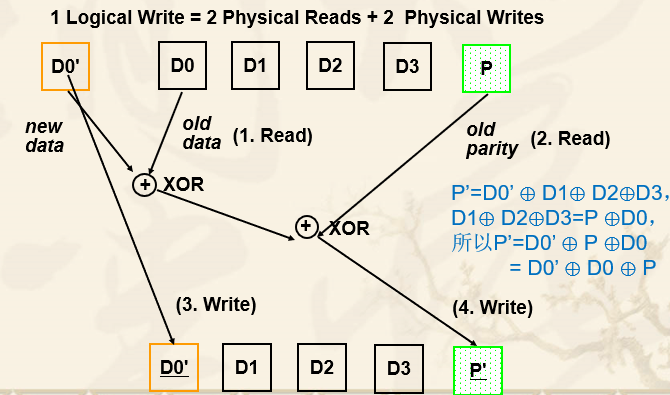
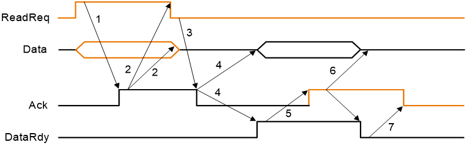

### Chapter 1: Introduction

* Today’s computers are built on **2 key principles**
  * Instruction are represented as numbers.
  * Programs can be stored in memory to be read or written just like numbers
* **Four Design Principles**
  * Simplicity favors regularity (简单有利于规整)
  * Smaller is faster
  * Good design demands good compromises
  * Make the common case fast


### Chapter 2: Instructions: Language of the Machine

* Mapping registers into numbers

  * \$s0 to \$s7 : 16 to 23
  * \$t0 to \$t7 : 8 to 15

* MIPS fields

  * R-type: op (6) + rs (5) + rt (5) + rd (5) + shamt (5) + funct (6)
  * I-type: op (6) + rs (5) + rt (5) + address/immediate (16)
  * J-type: op (6) + address (26)

* Preserve (save) registers

  ```assembly
  sw      $t1, 8($sp)   #       push  $t1   #push  A
  sw      $t0, 4($sp)   #       push $t0    #push  B
  sw      $s0, 0($sp    #       push $s0    #push C
  
  lw    $s0, 0($sp)     #        pop  $s0  #pop C
  lw    $t0, 4($sp)     #        pop  $t0   #pop B
  lw    $t1, 8($sp)     #        pop  $t1   #pop A
  ```

* Saves on stack
  * Caller A saved
    * \$a0-a3
    * \$ra
    * \$t0-t9
    * \$s0-s7 **needn't**
  * Callee B saved
    * \$s0-s7
    * Local variables
* Little endian and big endian: 0x8899AABB in address 16-19
  * Little endian: high bits in high address: 0x88 in 19
  * Big endian: high bits in low address: 0x88 in 16
* MIPS addressing mode summary
  * Register addressing: `add $s0, $s0, $s0`
  * Base addressing: `lw $s1, 0($s0)`
  * Immediate addressing: `addi $s0, $s0, 4`
  * PC-relative addressing: `beq $s0, $s1, L1`
  * Pseudodirect addressing: `j Address`


### Chapter 3: Arithmetic for Computer

* Number formats

  * sign and magnitude
  * 2's complement
  * 1's complement
  * Biased notation: for 8-bit X, X's biased notation is X + 2$^7$
    * 0000 0000 = minimal negative (-2$^7$)
    * 1111 1111 = maximal positive (2$^7$ - 1)

* Sign extension

* Unsigned operations

  * e.g. slt VS sltu, slti VS sltiu

* Overflow

  * add, addi, sub cause exceptions
  * addu, addiu, subu **don't **cause exceptions

* Multiplication

  * mult \$s2, \$s3      64-bit result in 2 internal registers hi and lo
  * mfhi \$s0      move hi
  * mflo \$s1      move lo

* Floating point numbers

  * sign
  * Significand: e.g. 13.54 for 13.54*10$^7$
  * Fraction: e.g. 0.2345 for 1.2345
  * exponent

* IEEE 754

  * Single precision

    |  31   | 30 .... 23 | 22 .... 0 |
    | :---: | :--------: | :-------: |
    |   S   |  exponent  | fraction  |
    | 1 bit |   8 bits   |  23 bits  |

  * Double precision

    |  31   | 30 .... 20 | 19 .... 0 |      31 .... 0       |
    | :---: | :--------: | :-------: | :------------------: |
    |   S   |  exponent  | fraction  | fraction (continued) |
    | 1 bit |  11 bits   |  20 bits  |       32 bits        |

  * Exponent biased: 127 for single, 1023 for double

  * Summary: $(-1)^S*(1+\text{fraction})*2^{\text{exponent}-\text{bias}}$

  * Special values

    * Exponent = Fraction = 0: zero
    * Exponent = 255, Fraction = 0: infinity
    * Exponent = 255, Fraction $\neq$ 0: not a number (NAN)

* MIPS instructions (floating number)

  * add.s, sub.s, mul.s, div.s (single)
  * add.d, sub.d, mul.d, div.d (double)
  * c.eq.s, c.neq.s, c.lt.s (single)
  * .d (double)
  * Registers: \$f0-31, double precision in 2 registers


### Chapter 5: The processor : Datapath and control

#### SCPU

* Signals for datapath
  * RegDst
  * RegWrite
  * ALUSrc
  * Branch
  * ALUOp[1:0]
    * 01 (X1): beq, ALU: subtract
    * 00: lw / sw, ALU: add
    * 10: R-type, ALU: see Function Code
      * 010: add
      * 110: sub
      * 000: and
      * 001: or
      * 100: nor
      * 011: xor
      * 111: slt
  * MemWrite
  * RegWrite
  * MemtoReg
  * Jump
* CPU Performance
  CPU Time = CPU clock cycles for a program $\times$ *Clock cycle time*
  CPU Time = CPU clock cycles for a program / Clock Rate   (Clock Rate = 1 / Clock cycle time)
  ***CPI*** (Clock cycles per instruction) = CPU clock cycles for a program / Instruction count
  CPU Time = CPI $\times$ Instruction count $\times$ Clock cycle time
  MIPS = Instruction count / (Execution time $\times$ 10$^6$) = Clock Rate / (CPI $\times$ 10$^6$)
  MIPS: Million instruction per second

#### MCPU

* Steps
  
* Signals
  * RegDst
  * RegWrite
  * ALUSrcA
  * MemRead
  * MemWrite
  * MemtoReg
  * IorD
  * IRWrite
  * PCWrite
  * PCWriteCond
  * ALUOp[1:0]
  * ALUSrcB[1:0]
  * PCSource[1:0]
* Controller: Finite Statement Machine
  
  


### Chapter 7: Large and Fast: Exploiting Memory Hierarchy 

* SRAM
* DRAM
  * Refreshed periodically

#### Cache

* Direct Mapped
  * Index = *(Memory address)* modulo *(Number of blocks in cache)*
  * Memory address (32 bit): *TAG | Index* | Byte Offset
    * *TAG | Index* = Block address
  * Each Block in Cache: V(valid bit) | Tag | Data
  * Construction
    
  * Cache Size
    * Number of blocks = Data size / Block size
    * Index bits = $\log_2$(Number of blocks)
    * Tag bits = 32 - Index bits - Byte offset, Valid bit = 1 bit
    * Total Cache size = (Tag bits + Valid bit) * Number of blocks / 8 (bit to byte) + Data size **KB**
* Write hit: 2 strategies
  * Write-back: write only into cache, write back from cache to memory later
    * Inconsistent but fast
  * Write-through: write both into cache and memory
    * Consistent but slower
* Strategy of block replacement
  * random replacement
  * **Least-Recently used (LRU)**
  * First in, first out (FIFO)
* Set-associative cache
  * Index = *(Memory address)* modulo *(Number of Sets in cache)*
  * Construction (4-way as example)
    
  * Cache Size
    * Number of sets = Number of blocks / associativity
    * Index bits = $\log_2$(Number of sets)
    * Tag bits = 32 - Index bits - Byte offset, Valid bit = 1 bit
* Full associative
  * Number of sets = 1
  * Index bits = 0 bits
  * Tag bits = 32 - Byte offset

#### Virtual Memory

* Main memory can act as a cache for the secondary storage (disk)

* Pages
  
  

* fully associative mapping method

  * write-back strategy

* Making Address Translation Fast----TLB (translation look aside buffer)

  


### Chapter 8: Storage, Networks and Other Peripherals

* Three Characteristics
  * Behavior
  * Partner
  * Data rate
* organization of hard disk
  * platters
  * tracks
  * sectors
* Access time
  * Seek
  * Rotational latency = $\frac{0.5\text{ rotation}}{\text{RPM}/60}$
  * Transfer
* Dependability, Reliability, Availability
  * MTTF    mean time to failure
  * MTTR    mean time to repair
  * MTBF (Mean Time Between Failures) = MTTF + MTTR
  * Availability = MTTF / MTBF

#### RAID

* RAID 0: No redundancy
* RAID 1: Disk Mirroring
* RAID 3: Bit-Interleaved Parity Disk
  * 偶校验: P = D1 $\oplus$ D2 $\oplus$ D3
* RAID 4
  * 每个块 (e.g. 512 bytes) 进行偶校验而不是每个bit
  * Small Write Algorithm
    * 
* RAID 5
  * 斜对角线

#### Buses

* 2 lines
  * Control lines
  * Data lines
  * *Address lines* (may not exist)
* Type of Buses
  * processor-memory
  * backplane
  * I/O 
* Synchronous bus : use a clock
* Asynchronous bus : use *handshaking*
* Handshaking protocol
  * ReadReq
  * DataRdy
  * Ack: acknowledge
  * 
* Bus Standards
  * SCSI
  * PCI
  * IPI
  * ISA, EISA
* Data Transfer Control Mode
  * Polling
  * Interrupt
  * DMA (direct memory access)

