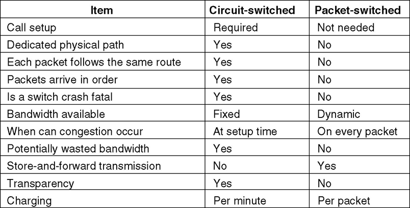

### Chapter 2  The Physical Layer

#### Theoretical Basis

* Bandwidth-Limited Signals 
  * Baud
  * bit rate (bps)
  * Bit rate = baud rate * number of bits
* The Maximum Data Rate of a Channel
  * Nyquist Theorem: Maximum Data Rate (bps) = $2H\log_2V$
    * V: discrete level (e.g. binary signal: V=2); H: bandwidth (kHz)
  * Signal-to-Noise Ratio (S/N), DB = $10\log_{10}(S/N)$
  * Shannon Theorem: Max Data Rate (bps) = $H\log_2(1+S/N)$

#### Transmission Media

* Magnetic Media
* Twisted Pair and Unshielded Twisted Pair (UTP)
  * Category 3, Category 5
* Coaxial Cable

* Fiber Optics
  * Single/Multi-mode fiber
  * DB = $10\log_{10}\frac{\text{transmitted power}}{\text{received power}}$
  * 3 wavelengths: 0.85, 1.3, 1.55 $\mu m$
  * light sources: LED and Semiconductor Laser
  * Fiber vs copper
    * higher bandwidth、lower attenuation、not affected by electromagnetic 、lighter weight、excellent security

#### Wireless Transmission

#### Telephone System

* Public Switched telephone Network (PSTN)
* Structure of the Telephone System

* Local Loop
  * ISP1: 33.6 kbps
  * ISP2: 56 kbps
* Modems (信号调制器)
  * Amplitude (振幅) modulation
  * Frequency modulation
  * Phase modulation
  * QPSK, 2bits

* bandwidth: Hz
* bit rate = baud rate * number of bits/symbol
  * QAM-16: 16 different combination, 2400 baud, 2400 * 4 bit = 9600 bps
* Modems
  * full duplex(全双工）, half duplex (半双工）, simplex（单工）
  * V.90 (56kb/s)
    * 33.6 kbps upstream channel, 56 kbps downstream channel
  * MNP5, V.42bis
* Digital Subscriber Lines

* Trunks and Multiplexing
  * FDM (Frequency Division Multiplexing)
    * Group: 12 4000-Hz voice channels -> 60-108kHz band
    * 5 groups -> supergroup
    * 5 or 10 supergroups -> mastergroup
  * WDM (Wavelength Division Multiplexing)
  * TDM (Time Division Multiplexing)
    * T1: 1.544 Mbps, Channel 1-24# for data, 193# bit for synchronization
      193 bit $\div$ 125 ms = 1.544 Mbps
    * E1 system of CCITT, 2.048 Mbps
  * CDM (Code Division Multiplexing), CDMA (Code Division Multiple Access)
    * chip sequence
    * send bit 1, send its chip sequence
    * send bit 0, send the negation of its chip sequence
    * receiver: add all chip sequences
* Switching
  * Circuit Switching (a) vs Packet Switching (b)
    
    
  * The timing of events in (a) Circuit switching (b) Message switching  (c) Packet switching
    